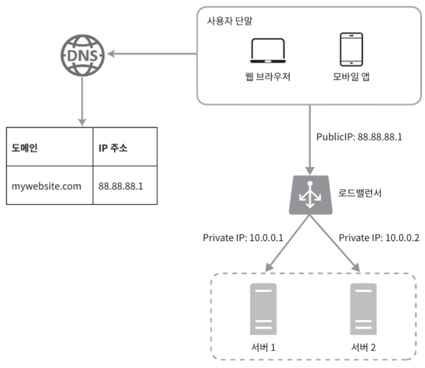
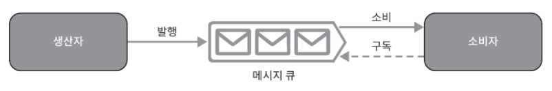
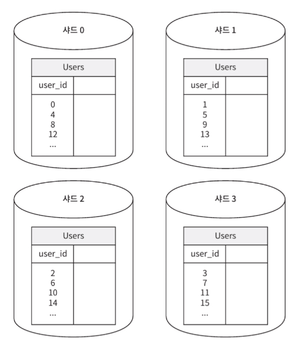
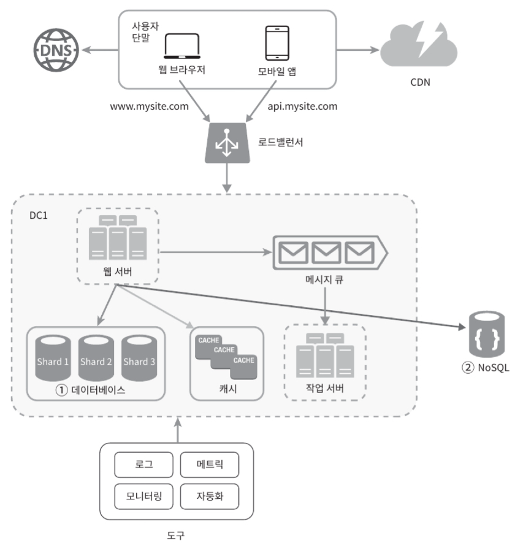

# ※ 데이터베이스의 종류

- 관계형 데이터베이스 (RDBMS)
  - 데이터를 테이블과 열, 컬럼으로 표현
  - 여러 테이블에 있는 데이터 ⇒ join
  - ex) MySQL, OracleDB, PostgreSQL, …
- 비 관계형 데이터베이스 (NoSQL)
  - 4 부류
    - 키-값 저장소 (key-value store)
    - 그래프 저장소 (graph store)
    - 컬럼 저장소 (column store)
    - 문서 저장소 (document store)
  - 일반적으로 join 지원 X
  - ex) CouchDB, Neo4j, Cassandra, HBase, Amazon DynamoDB, …
  - 언제 사용?
    - 아주 낮은 응답 지연시간이 요구됨
    - 다루는 데이터가 비정형 (=관계형 데이터가 아님)
    - 데이터(json, yaml, xml 등)를 직렬화(serialize) or 역직렬화(deserialize) 할 수 있기만 하면 됨
    - 아주 많은 양의 데이터를 저장할 필요가 있음

# Scale-up vs Scale-out

- scale-up (수직적 규모 확장)
  - 서버에 고사양 자원을 추가 (더 좋은 CPU, 더 많은 RAM 등)
  - 서버로 유입되는 트래픽의 양이 적을 때 좋음
  - 장점
    - 단순함
  - 단점
    - 한계가 존재 (물리적, 하드웨어적으로 무한 추가 불가능)
    - 장애에 대한 자동복구나 다중화 방안 X
- **scale-out (수평적 규모 확장)**
  - 더 많은 서버를 추가
  - 대규모 애플리케이션에 좋음 - 보통 더 적합
  - 로드밸런서, 데이터 다중화 등의 **계층적 구성 추가**

## 계층적 구조 설정

### 웹 계층 - 로드밸런서 (Load Balancer)

<aside>
💡 부하 분산 집합에 속한 웹 서버들에게 트래픽 부하를 고르게 분산하는 역할

</aside>

- 웹 서버는 클라이언트의 접속을 직접 처리하지 않음
- 로드밸런서는 웹 서버와 통신하기 위해 사설 IP주소를 사용한다.
- 장점
  - 부하 분산 - 트래픽이 가파르게 증가할 때 대처 가능
  - 장애 자동복구 불가 문제 해결 (no failover)
  - 고가용성 (availability)

### DB 계층 - 데이터베이스 다중화

<aside>
💡 서버 사이에 주(master)-부(slave) 관계를 설정하고,
데이터 원본은 master 서버에, 사본은 slave 서버에 저장하는 방식

</aside>

- master 서버
  - 쓰기 연산 지원
- slave 서버
  - 읽기 연산만 지원
  - master의 데이터베이스로부터 데이터의 사본을 전달 받음
- 대부분의 애플리케이션은 읽기 연산 비중 >>>> 쓰기 연산 비중
- 장점
  - 더 나은 성능 - 읽기 연산이 slave 데이터베이스 서버들로 분산되어, 병렬로 처리될 수 있는 query 수가 늘어남
  - 안정성 - 하나의 데이터베이스 서버가 다운되도, 데이터 보존 가능
  - 가용성 - 하나의 데이터베이스 서버가 다운되도, 다른 DB서버에서 데이터를 가져와 계속 서비스 가능

## 응답시간 개선

### 캐시 (Cache)

<aside>
💡 값비싼 연산 결과 or 자주 참조되는 데이터를 메모리 안에 두고,
뒤이은 요청이 보다 빨리 처리될 수 있도록 하는 저장소

</aside>

> 애플리케이션의 성능 ⇒ DB 호출이 얼마나 적게 일어나는가

- 데이터가 잠시 보관되는 곳
- 장점
  - 성능 개선 - DB보다 훨씬 빠름
  - DB의 부하를 줄일 수 있음
  - 캐시 계층의 규모를 독립적으로 확장 가능

읽기 주도형 캐시 전략

- **캐시 사용시 유의할 점**
  - 데이터 갱신은 자주 일어나지 않지만, 참조는 빈번하게 일어나는 상황
  - 영속적으로 보관할 데이터는 안됨 - 휘발성 메모리에 두므로
  - 캐시에 보관된 데이터에 대한 만료 시간 정책
  - 일관성 유지
    - 실제 데이터 vs 캐시에 저장된 데이터가 같은지?
    - _페이스북 논문 <Scaling Memcache at Facebook>_
  - 장애 대처 방안
  - 캐시 메모리의 크기
    - 너무 작으면 : 데이터 교체가 너무 자주 일어남
      ⇒ 캐시 메모리를 과할당 → 보관될 데이터가 갑자기 늘어났을 때 문제도 방지 가능
  - 데이터 방출 정책
    - ex) LRU, LFU, FIFO

### 콘텐츠 전송 네트워크 (CDN)

<aside>
💡 정적 콘텐츠 (이미지, 비디오, CSS, Javascript 파일 등)를 전송하는데 쓰이는,
지리적으로 분산된 서버의 네트워크

</aside>

- 사용자가 “물리적으로” CDN 서버로부터 가까울수록, 더 빠르게 정적 콘텐츠를 전달 받으므로, 웹 사이트가 더 빠르게 로드될 것이다.
- **CDN 사용시 유의할 점**
  - 비용
    - 보통 third-party 제공자에 의해 운영됨
    - CDN으로 들어가고 나가는 데이터 전송 양에 따라 요금을 내게 됨
    - 자주 사용되지 않는 콘텐츠를 캐싱하는 것은 안 좋음
  - 적절한 만료 시한 설정
  - 장애 대처 방안
  - 콘텐츠 무효화 방법 - 아직 만료되지 않은 콘텐츠라도, CDN에서 제거
    - Object Versioning - 콘텐츠의 다른 버전을 서비스하도록 함. url 마지막에 버전 번호를 인자로 넘김

## 웹 계층의 수평적 확장

### 무상태(stateless) 웹 계층

<aside>
💡 상태 정보를 웹 계층에서 제거 후, RDB나 NoSQL 같은 지속성 저장소에 보관하고,
필요할 때 가져오는 것

</aside>

상태 정보 의존적 아키텍처

- 같은 클라이언트로부터의 요청은 항상 같은 서버로 전송되어야 함
  - 사용자 A의 상태 정보는 서버 1에 저장됨
  - 사용자 A를 인증하기 위해 HTTP 요청은 반드시 서버 1로 전송되어야 함
- 로드밸런서가 이를 지원 (sticky session)
  - but, 부담
  - but, 확장성 어려움
  - but, 장애 처리 복잡

무상태 아키텍처

- 상태 정보가 웹 서버로부터 물리적으로 분리
- 사용자로부터의 요청은 어떤 웹 서버로도 전달 가능
- 상태 정보가 필요하면 공유 저장소 (shared storage)로부터 가져옴

### 데이터 센터

> 전 세계 어디서도 서비스를 쾌적하게 사용할 수 있도록 가용성을 높일 수 있다.

장애 발생 시

- 사용자의 위치에 따라 가장 가까운 데이터 센터로 안내 (geoDNS-routing)
- 유의할 점
  - 트래픽 우회 : 올바른 데이터 센터로 트래픽을 보내는 방법
  - 데이터 동기화 (synchronization)
    - 데이터를 여러 데이터 센터에 걸쳐 다중화 (ex. 넷플릭스)
  - 테스트와 배포 (deployment)

## 컴포넌트 분리, 독립적 확장

### 메시지 큐 (Message Queue)

<aside>
💡 메시지의 무손실 (durability)을 보장하는, 비동기 통신을 지원하는 컴포넌트

</aside>

- 메시지의 버퍼 역할
- 메시지를 비동기적으로 전송
- 구조
  - 생산자/발행자 (producer/publisher) 라는 입력 서비스가 메시지를 만들어, 메시지 큐에 발행 (publish)
  - 메시지 큐에는 소비자/구독자(consumer/subscriber)라 불리는 서비스가 연결되어 있는데, 메시지를 받아 그에 맞는 동작을 수행

- 장점
  - 서비스 or 서버 간 결합이 느슨해짐 → 확장성
  - pub, sub 중 하나가 다운되어 있어도, 나머지가 메시지를 발행하거나 수신할 수 있음 → 결함에 대한 내성

## 도구, 분석

### 로그(log), 메트릭(metric), 자동화 (automation)

- 로그
  - 에러 로그 모니터링
- 메트릭
  - 사업 현황에 관한 유용한 정보, 시스템의 현재 상태 파악
  - ex)
    - 호스트 단위 메트릭 : CPU, 메모리, 디스크 I/O
    - 종합(aggregated) 메트릭 : 데이터베이스 계층의 성능, 캐시 계층의 성능
    - 핵심 비즈니스 메트릭 : 일별 능동 사용자(Daily Active User), 수익, 재방문
- 자동화
  - CI/CD

## 데이터베이스의 규모 확장

### 수직적 확장

- 하드웨어의 한계
- SPOF (Single Point of Failure) 로 인한 위험성
- 비용이 많이 듬

### 수평적 확장 (샤딩, Sharding)

<aside>
💡 데이터베이스를 샤드(shard)라고 부르는 작은 단위로 분할하는 기술

</aside>

- 모든 샤드는 같은 스키마 사용, but, 샤드에 보관되는 데이터 사이에는 중복이 없음
- **샤딩 키 (sharding key)** 가 중요
  - 데이터를 어떻게 분산될지 정하는 하나 이상의 컬럼 (ex. uesr_id)
- **샤딩 시 유의할 점**
  - 데이터의 재 샤딩 (resharding) → 다른 샤드 키를 통한 데이터의 재배치
    - 데이터가 너무 많아져서 하나의 샤드로는 더이상 감당하기 어려울 때
    - 샤드 간 데이터 분포가 균등하지 못하여 어떤 샤드에 할당된 공간 소모가 다른 샤드에 비해 빠를 때 (=샤드 소진)
      ⇒ 안정 해시 (consistent hashing) 기법
  - 유명인사 (celebrity) 문제 (=hotspot key 문제)
    - 특정 샤드에 질의가 집중되어 서버에 과부하가 걸리는 문제
  - 조인과 비정규화
    - 하나의 데이터베이스가 여러 샤드 서버로 쪼개지면, 여러 샤드에 걸친 데이터를 조인하기가 어려워짐
      ⇒ 데이터베이스를 비정규화하여 하나의 테이블에서 질의가 수행될 수 있도록 함

# 결론

- 웹 계층은 무상태 계층으로
- 모든 계층에 다중화 도입
- 가능한 많은 데이터를 캐시할 것
- 여러 데이터 센터를 지원할 것
- 정적 콘텐츠는 CDN을 통해 서비스할 것
- 데이터 계층은 샤딩을 통해 규모를 확장
- 각 계층은 독립적 서비스로 분할할 것
- 시스템을 지속적으로 모니터링하고, 자동화 도구들을 활용할 것

 
- 구성의 심화 단계

